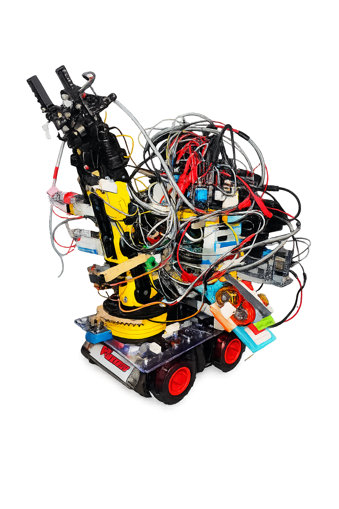

# Alfa-T

Mobile robotic manipulator developed using ESP32 controllers, AS5600 encoders, limit switches, and custom robotic arm mechanisms.

## Current Features

- Mobile rover platform
- 5 motor drive and manipulation system
- Robotic arm with gripper
- ESP32 motor control
- AS5600 magnetic encoders
- Limit switches for homing and safety
- 12V battery power system

## Development Status

Mechanical platform completed.

Current work:
- Encoder integration
- Joint position control
- Gripper control
- ROS 2 integration planning

## Future Goals

- ROS 2 communication
- Autonomous object handling
- Cooperative operation with Vica-M rover
- Vision-assisted manipulation
